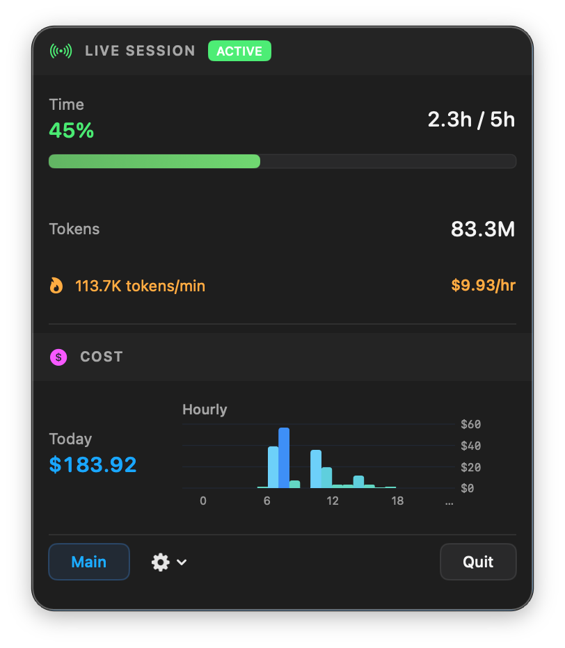
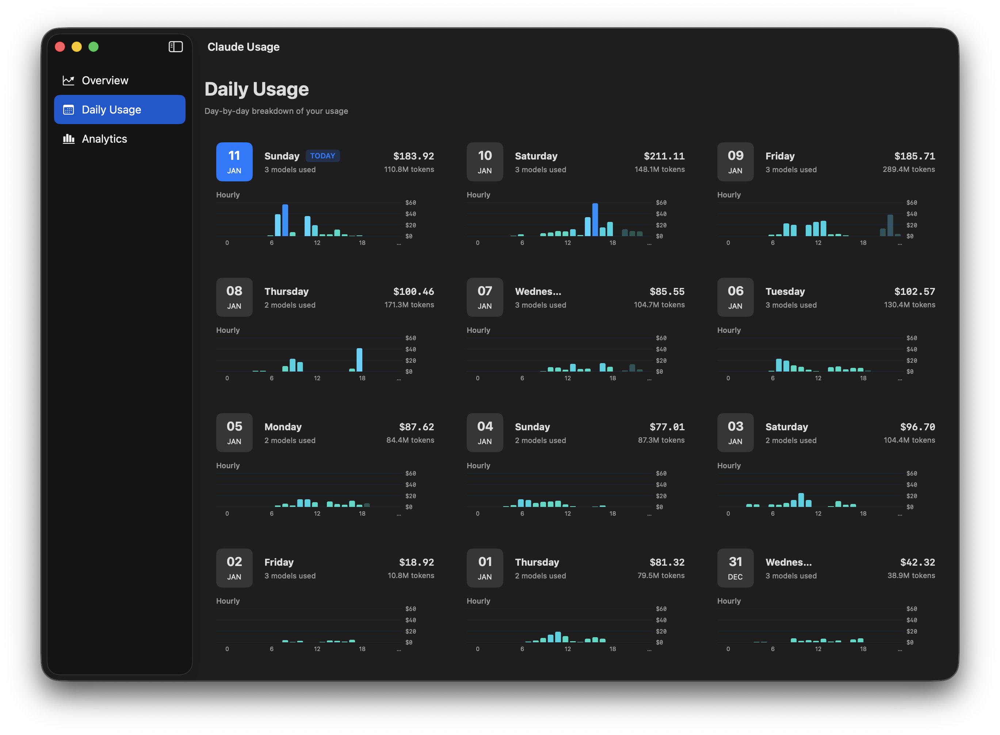
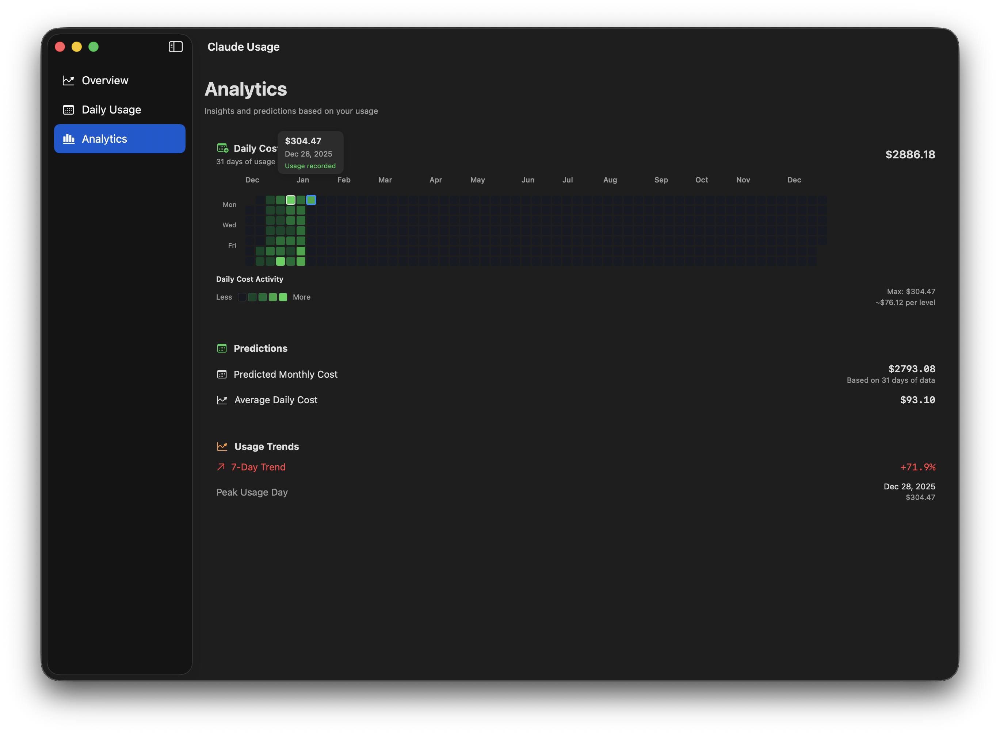
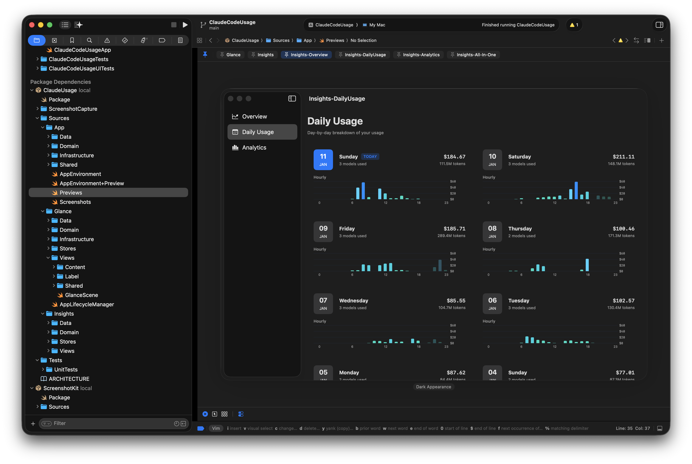

# ClaudeCodeUsage

A macOS menu bar app for tracking Claude Code usage and costs in real-time.

## Features

### Menu Bar
- Today's cost always visible
- Live session indicator with duration, tokens, and cost
- Color-coded cost warnings (green → orange → red)

<p align="center">
  
</p>

### Daily Usage
- Day-by-day breakdown of your usage
- Hourly cost charts for each day

<p align="center">
  
</p>

### Analytics
- Yearly heatmap (GitHub-style)
- Predictions and usage trends

<p align="center">
  
</p>

## Requirements

- macOS 15.0+

## Installation

[Download the latest DMG](https://github.com/webcpu/ClaudeCodeUsage/releases/latest/download/ClaudeCodeUsage.dmg), open it, and drag ClaudeCodeUsage to Applications.

<p align="center">
  
</p>

The app reads usage data from `~/.claude/projects/` (Claude Code's local storage).

## Development

### Build & Run

Open `ClaudeCodeUsage.xcodeproj` in Xcode, then build and run (⌘R).

### Develop UI with Claude Code

#### Setup

1. Open `ClaudeCodeUsage.xcodeproj` in Xcode
2. Show Canvas: Editor → Canvas (or ⌥⌘↩)
3. Select a SwiftUI view file to see its preview

<p align="center">
  
</p>

#### Workflow

Give Claude Code a prompt like this:

> Make the menu bar chart use a gradient from blue to purple.
>
> After making changes, run:
> ```
> swift run --package-path Packages/ClaudeUsage ScreenshotCapture
> ```
> Then read the screenshot from `/tmp/ClaudeUsage/` to verify. If it doesn't look right, keep iterating until it matches expectations.

You can also provide a reference image:

> Update the Analytics view to match the style in this image: @reference-design.png
>
> Use ScreenshotCapture to verify your changes match the reference.

Claude Code will edit → capture → verify → repeat until the result looks correct.

The best part: you can see the visual effects of changes immediately in Xcode previews. All views have previews with real data for rapid iteration without running the full app.

## Architecture

See [ARCHITECTURE.md](Packages/ClaudeUsage/ARCHITECTURE.md) for detailed design documentation.

## License

MIT
